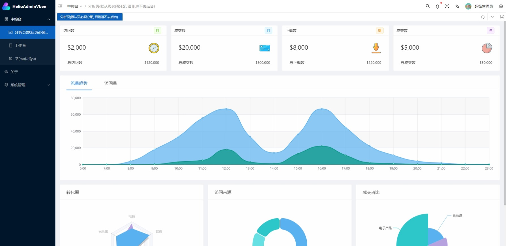
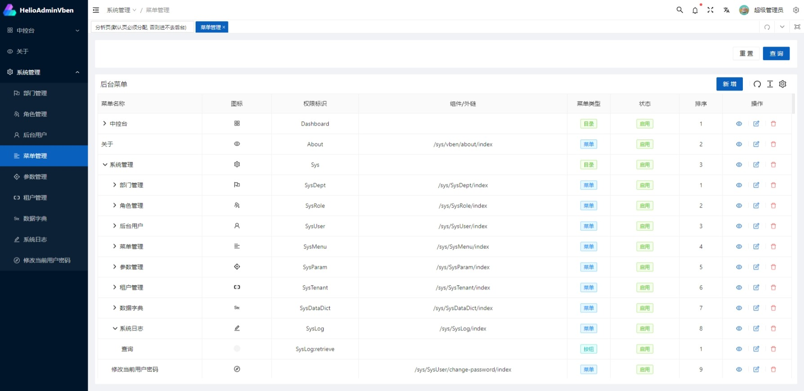
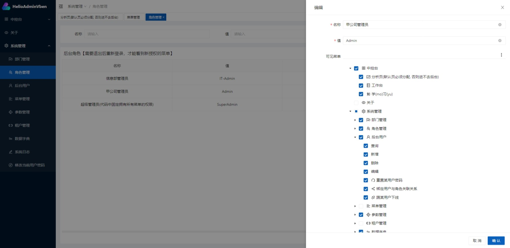

# helio-admin-vue-vben

## 项目说明
基于[Vue Vben Admin 2.3.0](https://github.com/anncwb/vue-vben-admin/tree/v2.3.0) 改造适配的后台管理前端模板，开箱即用

[源项目官方文档](https://vvbin.cn/doc-next/)

#### 相较于原版，存在以下变更
> 前端我只是个半吊子……别打我……
- 删除mock目录、test目录、.github目录
- 删除.husky配置文件（需要项目规范的话，可以从源项目重新复制配置文件）
- 删除CHANGELOG*.md，.gitpod.yml
- 调整自带组件路径至`/@/views/sys/vben`
- 侧边菜单统一为后端返回
- 修改后端接口返回体字段名
- ......


## 如何使用

1. 从GitHub或Gitee克隆项目源码，到自己的电脑上
2. 找到根目录下的`.env.development`，根据后端的类型（单体版or微服务版），修改`VITE_GLOB_API_URL`（全局API_BASE_URL）
3. 在根目录依次执行命令行命令：
    ```
    yarn install
    yarn serve
    ```
4. 浏览器访问http://127.0.0.1:3100 ，就能看到后台管理页面了，默认账户密码`admin admin`


## License
[MIT](./LICENSE)


## 演示效果图



